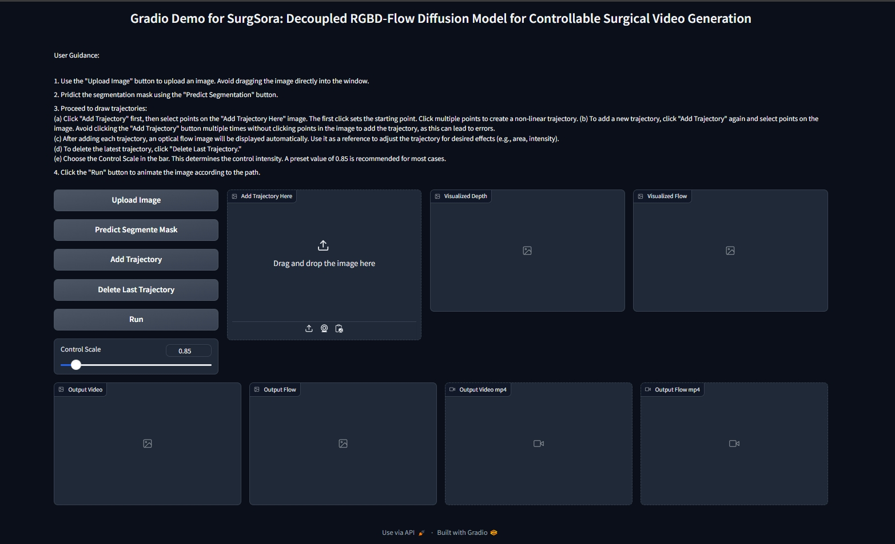

<div align="center">
<samp>
  
<h1> Object-Aware Diffusion Model for Controllable Surgical Video Generation
<be> (SurgSora) </h1>

<h4> <b>Original authors of the baseline:</b> Tong Chen*, Shuya Yang*, Junyi Wang*, Long Bai†, Hongliang Ren, and Luping Zhou† </h3>

<h4> Medical Image Computing and Computer Assisted Intervention (MICCAI) 2025 </h3>
</samp>

**[[```arXiv```](<https://arxiv.org/abs/2412.14018>)]**


</div>     

<p align="center">
  
</p>

## Update

· Oct/2025: 📢📢📢 Training Code Released!

· Jul/2025: 🎉🎉🎉 Our Work has been accepted by MICCAI 2025!

· Apr/2025: 🔥🔥🔥 SurgSora Gradio is online!


## Environment Setup

Use Python 3.11 with `uv`:

```
uv sync
source .venv/bin/activate
```

This installs the dependencies pinned in `pyproject.toml`, including
`torch==2.11.0` and `torchvision==0.26.0`. For LPIPS evaluation, install the
optional metric dependency:

```
uv sync --extra metrics
```

Legacy pip setup is still available with `pip install -r requirements.txt`.

Install [SAM2](https://github.com/facebookresearch/sam2) follow this:
```
git clone https://github.com/facebookresearch/sam2.git && cd sam2

uv pip install -e .
```

## Training
stage 1
```
bash train_stage1.sh
```
stage 2
```
bash train_stage2.sh
```

## SurgWMBench 20-Anchor Training

The SurgWMBench adaptation uses the official manifests under
`/mnt/hdd1/neurips2026_dataset_track/SurgWMBench`. Each sample loads the 20
human-labeled anchor frames, conditions on anchor frames 1-5 and their observed
trajectory points, and jointly trains one model to predict anchor frames and
trajectory points 6-20. Metrics are reported by slicing the same 15-step output
into 5, 10, and 15 step horizons.

Train a small smoke run:
```
python Training/train_surgwmbench_20anchor.py \
  --pretrained-model-name-or-path ./Training/ckpts/stable-video-diffusion-img2vid-xt-1-1 \
  --output-dir ./Training/logs/surgwmbench_20anchor \
  --max-clips 1 --max-train-batches 1 --num-train-epochs 1
```

Evaluate at original frame resolution:
```
python Training/eval_surgwmbench_20anchor.py \
  --pretrained-model-name-or-path ./Training/ckpts/stable-video-diffusion-img2vid-xt-1-1 \
  --checkpoint-dir ./Training/logs/surgwmbench_20anchor \
  --manifest manifests/val.jsonl --max-clips 1
```

The model input excludes future anchor coordinates. `sampled_indices` are used
only to select the 20 human-anchor frames from each dense clip, and future
trajectory points are used only as training and evaluation labels.
Joint training adds robustness augmentation to the observed input trajectory
points with Gaussian noise and random per-point masking.

Pass `--prediction-task image-only` to train or evaluate the image-only variant
without trajectory inputs, trajectory supervision, or `trajectory_head.pt`.

See [USAGE.md](USAGE.md) for `uv sync`, single-GPU, and multi-GPU training
commands.


## Download checkpoints

1. Download the pretrained checkpoint of [DAV2](https://huggingface.co/depth-anything/Depth-Anything-V2-Base/resolve/main/depth_anything_v2_vitb.pth) from huggingface to `./mdoels/dav2`.

2. Download the pretrained checkpoint of CMP from [here](https://huggingface.co/MyNiuuu/MOFA-Video-Traj/blob/main/models/cmp/experiments/semiauto_annot/resnet50_vip%2Bmpii_liteflow/checkpoints/ckpt_iter_42000.pth.tar) from huggingface to `./mdoels/cmp`.

The final structure of checkpoints should be:


```text
./models/
|-- DAV2
|-- CMP
|-- controlnet
|   |-- config.json
|   `-- diffusion_pytorch_model.safetensors
|-- stable-video-diffusion-img2vid-xt-1-1
|   |-- ...
|   `-- model_index.json
```

## Run Gradio Demo

`python gradio_demo_run.py`

<td align="center">
  
</td>
